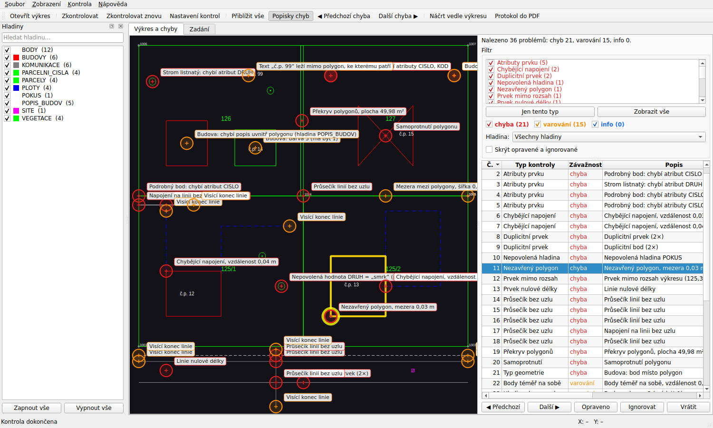

# Kontrola výkresu

Desktopová aplikace pro Windows, která **před odevzdáním zkontroluje topologii a atributy
geodetického výkresu** z MicroStationu. Podobně jako nadstavba MGEO najde nezavřené polygony,
visící konce, průsečíky bez uzlu, duplicity, prvky na špatné hladině nebo chybějící atributy.
Každou chybu ve výkresu **zakroužkuje a popíše**.

Aplikace je určená jako předkontrola školního výkresu. Pravidla si vytvoříte z tabulky atributů
od učitele nebo ze vzorového výkresu.



> Všechna data zůstávají na vašem počítači. Aplikace nic nikam neodesílá.

---

## Obsah

1. [Instalace a spuštění](#instalace-a-spuštění)
2. [Rychlý start s ukázkovými daty](#rychlý-start-s-ukázkovými-daty)
3. [Vyzkoušení po krocích](#vyzkoušení-po-krocích)
4. [Převod DGN na DXF](#převod-dgn-na-dxf)
5. [Kontroly](#kontroly)
6. [Zadání: tabulka atributů, náčrty, vzor, podklady](#zadání-tabulka-atributů-náčrty-vzor-podklady)
7. [Pravidla a konfigurace v YAML](#pravidla-a-konfigurace-v-yaml)
8. [Výstupy](#výstupy)
9. [Příkazová řádka](#příkazová-řádka)
10. [Sestavení .exe](#sestavení-exe)
11. [Pro vývojáře: struktura a přidání kontroly](#pro-vývojáře-struktura-a-přidání-kontroly)
12. [Známá omezení](#známá-omezení)

---

## Instalace a spuštění

### Hotový program (.exe)

**Stažení:** [KontrolaVykresu.exe](https://github.com/stepanvcelak11/kontrola-vykresu/releases/latest/download/KontrolaVykresu.exe)
(poslední verze, sestavuje se automaticky po každé změně). Program se neinstaluje, stačí ho
spustit. Windows může upozornit na neznámého vydavatele: *Další informace → Přesto spustit*.
Ukázková data jsou ve složce [`ukazky/`](ukazky/) (celý repozitář stáhnete přes
*Code → Download ZIP*). Program si můžete sestavit i sami, viz [Sestavení .exe](#sestavení-exe).

### Z Pythonu (Windows, Python 3.11 nebo novější)

```bat
git clone https://github.com/stepanvcelak11/kontrola-vykresu.git
cd kontrola-vykresu
python -m venv .venv
.venv\Scripts\activate
pip install -r requirements.txt
python spustit.py
```

Místo `python spustit.py` jde použít i `python -m kontrola`. Na Linuxu a macOS se postupuje
stejně, jen aktivace je `source .venv/bin/activate`.

Při prvním spuštění se vytvoří projekt **„Můj projekt“** ve složce
`Dokumenty\Kontrola výkresu\`. Při dalším spuštění se otevře naposledy použitý projekt.

---

## Rychlý start s ukázkovými daty

Složka `ukazky/` obsahuje:

| Soubor | Co to je |
|---|---|
| `ukazkovy_vykres.dxf` | malý polohopis v S-JTSK s **úmyslnými chybami** |
| `vzorovy_vykres.dxf` | stejný výkres bez chyb, slouží jako „vzor od učitele“ |
| `tabulka_atributu.xlsx`, `.csv` | ukázková tabulka prvků (číselník) od učitele |
| `konfigurace.yaml` | okomentovaná konfigurace: nastavení kontrol a pravidla |
| `nacrt.png` | jednoduchý náčrt |
| `vytvor_ukazky.py` | skript, který všechny ukázky znovu vytvoří |

1. Spusťte aplikaci a přetáhněte `ukazky/ukazkovy_vykres.dxf` do okna.
2. Přepněte na záložku **Zadání → Tabulka atributů** a přetáhněte sem
   `ukazky/tabulka_atributu.xlsx`. Průvodce sám rozpozná sloupce. Potvrďte **Vytvořit pravidla**.
   Souhrn ukáže, že vzniklo 10 pravidel a jeden řádek (`???`) se zpracovat nepodařilo.
3. Stiskněte **F5 (Zkontrolovat)**. Vpravo se objeví seznam chyb a ve výkresu kroužky.
4. Klikněte na řádek chyby: výkres se na ni přiblíží. Klávesy F7 a F8 přepínají předchozí
   a další chybu.
5. Opravte výkres v MicroStationu, uložte DXF a stiskněte **Zkontrolovat znovu (Ctrl+F5)**.
   Aplikace vypíše, kolik chyb ubylo.

---

## Vyzkoušení po krocích

Aplikace vznikala v šesti krocích. U každého je popsáno, jak ho vyzkoušet.

### Krok 1: načtení a zobrazení DXF

```bat
python spustit.py ukazky\ukazkovy_vykres.dxf
```

* Kolečko myši plynule přibližuje, tažení levým nebo prostředním tlačítkem posouvá.
  **Home** zobrazí celý výkres.
* Vlevo je panel **Hladiny**, kde jde každou hladinu vypnout. Ve stavovém řádku jsou
  souřadnice kurzoru.
* Menu **Zobrazení → Světlé pozadí** přepíná černé a bílé pozadí.

### Krok 2: framework kontrol a základní kontroly

```bat
python -m kontrola zkontroluj ukazky\ukazkovy_vykres.dxf
python -m kontrola zkontroluj ukazky\ukazkovy_vykres.dxf --seznam-kontrol
python -m pytest -q tests\test_zakladni_kontroly.py
```

V aplikaci otevřete **Kontrola → Nastavení kontrol**. Tam jde nastavit toleranci, zapnout
nebo vypnout jednotlivé kontroly, změnit jejich závažnost a parametry.

### Krok 3: panel chyb s kroužky, popisky a filtry

Otevřete ukázkový výkres a stiskněte F5.

* Kroužek má na obrazovce stále stejnou velikost a barvu podle závažnosti: červená je chyba,
  oranžová varování, modrá info.
* Popisky se zapínají a vypínají přes **Popisky chyb (Ctrl+L)**.
* Filtr typů chyb: odškrtnutím se skryjí kroužky i řádky. Dvojklik nebo tlačítko
  **Jen tento typ** zobrazí jen jeden typ. Dál jde filtrovat podle závažnosti a hladiny.
* Kliknutí na kroužek vybere řádek v tabulce. Tabulka se řadí kliknutím na záhlaví sloupce.
* Tlačítka **Opraveno** a **Ignorovat** uloží stav chyby do projektu. Pod tabulkou jde ke
  každé chybě napsat poznámku.
* Pole **Hledat** filtruje chyby podle textu (popis, hladina, číslo chyby).
* Chyba označená jako opravená, která se při opakované kontrole znovu objeví, se vrátí do stavu
  „nová“. Ignorované chyby zůstanou ignorované.

### Krok 4: záložka Zadání, import tabulky atributů

**Zadání → Tabulka atributů**: přetáhněte `ukazky/tabulka_atributu.xlsx` nebo `.csv`.
Průvodce ukáže náhled a odhadne řádek s hlavičkou i přiřazení sloupců. Obojí jde opravit.
Výsledná pravidla najdete na **Zadání → Pravidla**, kde je můžete upravit a uložit do YAML.

```bat
python -m pytest -q tests\test_import_projekt_export.py
```

### Krok 5: zbylé kontroly, vzorový výkres a podklady

* **Zadání → Vzorový výkres**: načtěte `ukazky/vzorovy_vykres.dxf` a pak použijte
  **Vytvořit pravidla ze vzoru** nebo **Porovnat s kontrolovaným výkresem**.
  Porovnání najde hladinu POKUS navíc a budovu s jinou barvou.
* **Zadání → Náčrt a fotky**: přidejte `ukazky/nacrt.png` a napište k němu poznámku.
  Tlačítko **Otevřít vedle výkresu (Ctrl+B)** zobrazí náčrt v panelu vedle výkresu. Panel jde
  odpojit do samostatného okna. Vpravo se nastavuje **podklad pod výkresem** (posun, měřítko,
  natočení, průhlednost).
* **Zadání → Podklady**: seznam všech souborů projektu s náhledem, datem, smazáním
  a nahrazením.
* **Soubor → Uložit projekt jako soubor .kontrola** uloží celý projekt do jednoho souboru.

```bat
python -m pytest -q tests\test_topologie.py tests\test_atributy.py
```

### Krok 6: exporty a sestavení .exe

**Soubor → Export**: seznam chyb do CSV nebo Excelu, protokol do PDF a DXF s hladinou
`KONTROLA_CHYBY`. Sestavení .exe popisuje oddíl [Sestavení .exe](#sestavení-exe).

---

## Převod DGN na DXF

Formát DGN z MicroStationu V8 (V8i, CONNECT) nejde číst žádnou volně dostupnou knihovnou.
Výkres proto uložte z MicroStationu jako **DXF**:

* **Jeden výkres:** *Soubor → Uložit jako…*, typ *AutoCAD Drawing Interchange (\*.dxf)*,
  v *Možnostech* jednotky v metrech.
* **Všechny výkresy najednou:** *Utilities → Batch Converter* (Dávkový převod). Přetáhněte
  do něj soubory `.dgn`, jako výstupní formát zvolte DXF a spusťte *Process*.

**Ukládejte DXF vedle DGN se stejným názvem.** Když pak do aplikace přetáhnete `vykres.dgn`,
aplikace sama použije `vykres.dxf`. Pokud je DXF starší než DGN, upozorní vás, že kontrolujete
starou verzi. Po opravě v MicroStationu stačí DXF uložit znovu a stisknout
**Zkontrolovat znovu**.

Automatický převod přes ODA File Converter se zkusí, jen pokud je nainstalovaný (cestu jde
zadat v Nastavení kontrol). Běžná verze ale DGN převádět nemusí.

Návod je i v menu **Nápověda → Jak převést DGN na DXF**.

---

## Kontroly

Každá kontrola je samostatná třída se společným rozhraním. Jde ji zapnout nebo vypnout,
nastavit jí závažnost (chyba / varování / info) a parametry. Všechny délky jsou v metrech.

Obecné nastavení:

* **Tolerance** (výchozí 0,05 m) je vzdálenost, do které se hledají chybějící napojení a body
  téměř na sobě.
* **Přesnost** (výchozí 0,0001 m) je vzdálenost, pod kterou jsou dva body totožné.

### Topologie (shapely, prostorový index STRtree)

| Kontrola (id) | Co hlídá | Výchozí |
|---|---|---|
| Nezavřený polygon (`nezavrene_polygony`) | linie, která má být polygonem, ale není uzavřená; bez pravidla lomená čára s konci blíž než `max_mezera`. Příklad hlášení: „Nezavřený polygon, mezera 0,03 m“ | chyba |
| Visící konec linie (`visici_konce`) | konec linie, u kterého v toleranci není jiná linie (dangle) | varování |
| Chybějící napojení (`chybejici_napojeni`) | konec linie je od jiné linie blíž než tolerance, ale není napojen | chyba |
| Duplicitní prvek (`duplicity`) | stejná geometrie dvakrát (i s opačným směrem), dva body na stejném místě | chyba |
| Samoprotnutí (`samoprotnuti`) | linie nebo polygon protíná sám sebe | chyba |
| Průsečík bez uzlu (`pruseciky_bez_uzlu`) | křížení linií nebo T-napojení bez lomového bodu | chyba |
| Prvek nulové délky (`nulova_delka`) | nulová délka nebo plocha, prázdný text, nulový poloměr | chyba |
| Překryv polygonů (`prekryvy_polygonu`) | polygony na stejné hladině se překrývají | chyba |
| Mezera mezi polygony (`mezery_polygonu`) | úzká štěrbina nebo malá díra mezi polygony | varování |
| Prvek mimo rozsah (`mimo_rozsah`) | prvek mimo zadaný obdélník nebo mimo území ČR v S-JTSK | chyba |
| Body téměř na sobě (`body_blizko`) | dva body blíž než tolerance, ale ne totožné | varování |

Topologické kontroly mají parametr **Jen hladiny**, který kontrolu omezí na vybrané
hladiny (např. `PARCELY, PLOTY*`).

### Atributy a konvence (podle pravidel)

| Kontrola (id) | Co hlídá | Výchozí |
|---|---|---|
| Atributy prvku (`atributy`) | povinné atributy a povolené hodnoty (číselníky) | chyba |
| Hladina, barva nebo styl (`symbologie`) | hladina, barva, styl a tloušťka čáry podle kódu | varování |
| Nepovolená hladina (`nepovolene_hladiny`) | prvek na hladině, která v pravidlech není | chyba |
| Nekódovaný prvek (`nekodovane`) | prvku nejde přiřadit žádný kód | varování |
| Popis (text) prvku (`texty`) | chybějící popis a text mimo polygon, ke kterému patří | varování |
| Typ geometrie (`typ_geometrie`) | bod, linie, polygon nebo text jiný, než kód očekává | chyba |

Atributy se čtou z:

* atributů bloků (ATTRIB),
* XDATA (zápis `KLIC=hodnota` nebo dvojice klíč a hodnota),
* textu u prvku: pravidlo `text.atribut` říká, že popis uvnitř polygonu, případně nejbližší
  text v okruhu, se použije jako hodnota atributu.

**Jak se prvku přiřadí kód:**

1. atribut `KOD` (případně `CODE`, `KOD_PRVKU`…),
2. jinak název buňky (bloku),
3. jinak hladina. Když je na jedné hladině víc pravidel, rozhodne typ geometrie, barva
   a styl čáry.

---

## Zadání: tabulka atributů, náčrty, vzor, podklady

Všechny soubory se kopírují do **složky projektu** a zůstanou tam i po zavření aplikace:

```
Dokumenty\Kontrola výkresu\<projekt>\
  projekt.yaml         název, zdroj výkresu, poznámky, stavy chyb, podklad pod výkresem
  pravidla.yaml        pravidla kontrol
  nastaveni.yaml       nastavení kontrol
  chyby.json           výsledek poslední kontroly
  vykres\              kopie kontrolovaného výkresu
  podklady\tabulky\    tabulky od učitele
  podklady\obrazky\    náčrty a fotky
  podklady\vzor\       vzorový výkres
```

**Soubor → Uložit projekt jako soubor .kontrola** zabalí celou složku do jednoho souboru
(je to ZIP s příponou `.kontrola`). **Otevřít projekt** ho zase rozbalí.

### Tabulka atributů od učitele

Podporované formáty jsou `.xlsx`, `.csv` (středník nebo čárka, UTF-8 i Windows-1250) a `.pdf`.
PDF musí obsahovat tabulku jako text, skeny bez OCR číst nejde. Průvodce rozpozná tyto
hlavičky, na velikosti písmen a diakritice nezáleží:

| Pole | Příklady hlaviček |
|---|---|
| Kód | Kód, Code, Číslo prvku |
| Název | Název, Název prvku, Objekt |
| Hladina | Hladina, Level, Vrstva |
| Barva | Barva, Color (číslo, název „červená“ nebo `#RRGGBB`) |
| Styl čáry | Styl čáry, Typ čáry, Linetype (také „plná“, „čárkovaná“…) |
| Tloušťka | Tloušťka, Weight (mm) |
| Typ geometrie | Typ geometrie, Geometrie (bod / linie / plocha / text) |
| Povinné atributy | Povinné atributy, Atributy (oddělené čárkou) |
| Povolené hodnoty | Povolené hodnoty, Číselník (`lípa, dub` nebo `DRUH=lípa,dub; MATERIAL=zděná`) |
| Buňka / blok | Buňka, Blok, Cell, Značka |
| Popis na hladině | Popis na hladině, Hladina popisu |

Řádky s nadpisem skupiny (jediná vyplněná buňka) se přeskočí. Řádky bez kódu, s neplatným
nebo duplicitním kódem se vypíšou v souhrnu importu jako nezpracované.

### Náčrty a fotky

Podporované formáty jsou JPG, PNG, BMP, TIFF a PDF (vícestránkové PDF lze listovat).
Prohlížeč umí přibližovat, posouvat, otáčet a přepínat mezi obrázky. Ke každému obrázku jde
napsat poznámku a v editoru pravidel lze k pravidlu připojit obrázek. Obrázek může sloužit
i jako **podklad pod výkresem** s posunem, měřítkem, natočením a průhledností. Do kontrol
nevstupuje.

### Když máte od učitele jen PDF nebo náčrt (JPG)

Bez tabulky atributů a bez vzoru v DXF aplikace pořád zkontroluje:

* **všechnu topologii** (nezavřené polygony, napojení, průsečíky, duplicity…), ta pravidla nepotřebuje,
* **jednotnost hladin**: kontrola *Nejednotná symbologie hladiny* najde prvky, které mají jinou barvu,
  styl nebo tloušťku než většina prvků na stejné hladině.

Postup:

1. **Zadání → Vzorový výkres**: přetáhněte PDF nebo JPG od učitele.
2. **Vložit pod výkres…**: klikněte na bod v obrázku a na stejný bod ve výkresu, potom na druhý
   bod. Vzor se průhledně zobrazí pod výkresem ve správném měřítku a natočení. Vyberte výrazné
   body co nejdál od sebe, třeba rohy rámu nebo lomové body hranic.
3. U **PDF** (uloženého z MicroStationu, ne naskenovaného) použijte **Porovnat s kontrolovaným
   výkresem**. Vypíšou se čísla parcel, bodů a č.p., která ve vašem výkresu chybějí nebo přebývají.
4. **Vytvořit pravidla ze vzoru** nabídne návrh pravidel z vašeho vlastního výkresu. Projděte ho
   podle PDF nebo náčrtu (hladiny, barvy) a potvrďte. Kontroly pak hlídají, že se pravidel
   držíte v celém výkresu.

### Vzorový výkres

Ze vzoru se načtou používané hladiny, barvy, styly čar, tloušťky a buňky.

* **Vytvořit pravidla ze vzoru** navrhne pravidlo pro každou hladinu a každou buňku.
  Vy vyberete, která převzít.
* **Porovnat s kontrolovaným výkresem** vypíše chybějící a přebývající hladiny a buňky
  a jiné barvy a styly.

---

## Pravidla a konfigurace v YAML

Okomentovaný příklad je v souboru [`ukazky/konfigurace.yaml`](ukazky/konfigurace.yaml).
Obsahuje nastavení všech kontrol i pravidla pro ukázkový výkres. Zkrácená ukázka:

```yaml
nastaveni:
  tolerance: 0.05
kontroly:
  visici_konce: {zapnuto: true, zavaznost: varování}
paleta: microstation     # čísla barev: microstation (výchozí) nebo autocad (ACI)
rozsah: sjtsk            # nebo {xmin: .., ymin: .., xmax: .., ymax: ..}
povolene_hladiny: [RAM]
pravidla:
  - kod: "402"
    nazev: Strom listnatý
    geometrie: bod
    hladina: VEGETACE
    blok: STROM_L
    povinne_atributy: [DRUH]
    povolene_hodnoty:
      DRUH: [lípa, dub, javor]
```

**Barvy:** čísla barev v pravidlech jsou ve výchozím stavu **čísla MicroStationu** (0 bílá,
1 modrá, 2 zelená, 3 červená, 4 žlutá, 5 purpurová, 6 oranžová, 7 azurová…). MicroStation při
uložení do DXF barvy přečísluje na AutoCAD (ACI), proto aplikace porovnává barvy podle RGB:

* barvy 0–15 zná z výchozí barevné tabulky MicroStationu,
* pro ostatní barvy (16–255) načtěte barevnou tabulku, kterou máte v MicroStationu
  (*Nastavení kontrol → Obecné → Načíst barevnou tabulku…*). Umí binární `*.tbl` nebo text
  s řádky `číslo r g b` či `číslo;#RRGGBB`. Bez tabulky se tyto barvy neověřují
  a kontrola to napíše do poznámky,
* v hlášení je barva prvku také jako číslo MicroStationu, např. „barva 2 (má být 3)“.

Pokud učitel uvádí čísla barev z AutoCADu, přepněte „Čísla barev v pravidlech“ na *AutoCAD (ACI)*.
Tloušťky MicroStationu (wt 0–31) se v DXF ověřit nedají. Uvádějte je v mm, nebo je nechte prázdné.

---

## Srovnání s MGEO

| MGEO | Kontrola výkresu |
|---|---|
| Kontrola a oprava čárové kresby: duplicitní linie | Duplicitní prvek |
| … nedotažené a přetažené linie | Nedotažená / přetažená linie (tolerance, max. přetažení) |
| … průsečíky linií, linie nerozdělené v uzlu | Průsečík bez uzlu (volitelně „linie musí být v uzlu rozdělené“) |
| … volné konce | Visící konec linie |
| … krátké a bodové linie | Krátká linie nebo úsek, Prvek nulové délky |
| … blízké body | Body téměř na sobě |
| Kontrola a oprava duplicitních prvků | Duplicitní prvek (i body, texty, buňky) |
| Kontrola a změna symbologie | Hladina, barva nebo styl; Nepovolená hladina; Nekódovaný prvek |
| Plocha má právě jeden definiční bod | Popis (text) prvku: chybí popis / více popisů v ploše / popis mimo plochu |
| Režim „oprava“ | **Kontrola → Automatická oprava** (do nového DXF) |
| Značky chyb ve výkresu | Kroužky s popisky; export DXF s hladinou `KONTROLA_CHYBY` |

**Automatická oprava** (Ctrl+R, z příkazové řádky `--oprav vystup.dxf`) uloží opravený výkres
vždy do nového souboru. Opraví:

* duplicity a linie nulové délky,
* nedotažené a přetažené linie do tolerance,
* chybějící uzly (lomené čáry dostanou nový vrchol, úsečky se rozdělí),
* téměř uzavřené polygony,
* volitelně symbologii podle pravidel.

Co opravit nejde (plochy, překryvy, atributy), zůstane v seznamu k ruční opravě.

MGEO pracuje přímo nad výkresem DGN v MicroStationu. Tato aplikace kontroluje výkres uložený
jako DXF a opravy zapisuje do nového DXF, který se otevře zpět v MicroStationu.

---

## Výstupy

* **CSV** se středníkem a desetinnou čárkou, v českém Excelu se otevře správně.
* **Excel** má list *Chyby* s filtrem a barvami závažnosti a list *Souhrn*.
* **Protokol PDF** obsahuje souhrn podle typů kontrol, přehledku výkresu s kroužky, tabulku
  všech chyb a výřezy problémových míst.
* **DXF s hladinou `KONTROLA_CHYBY`** je kopie výkresu doplněná o kroužky a texty chyb.
  Po otevření v MicroStationu přesně vidíte, kde opravovat.

Pokud je zapnutý filtr, aplikace se zeptá, jestli exportovat jen zobrazené chyby.

---

## Příkazová řádka

```bat
python -m kontrola zkontroluj vykres.dxf --pravidla ukazky\konfigurace.yaml ^
       --csv chyby.csv --xlsx chyby.xlsx --pdf protokol.pdf --dxf kontrola.dxf
python -m kontrola zkontroluj vykres.dxf --tolerance 0.02 --jen nezavrene_polygony duplicity
```

Návratový kód je 1, pokud výkres obsahuje chyby, jinak 0. Hodí se to například pro dávkovou
kontrolu více výkresů.

---

## Sestavení .exe

Na Windows s Pythonem 3.11 nebo novějším spusťte:

```bat
sestavit_exe.bat
```

Skript vytvoří virtuální prostředí, nainstaluje knihovny, spustí testy a pomocí PyInstalleru
sestaví jeden soubor **`dist\KontrolaVykresu.exe`**. Konfigurace je v
`kontrola_vykresu.spec`.

Stejné sestavení běží automaticky na GitHubu (`.github/workflows/build.yml`). Hotové .exe
je ke stažení jako artefakt v záložce Actions.

---

## Pro vývojáře: struktura a přidání kontroly

```
kontrola/
  model.py            prvek (Feature), výkres (Drawing), typ geometrie
  io/                 načítání: dxf_loader.py (ezdxf), dgn.py (ODA File Converter)
  checks/             kontroly: base.py (rozhraní Check, Issue, CheckContext),
                      topology.py, attributes.py
  rules.py            pravidla (číselník) a jejich YAML
  config.py           nastavení kontrol a jeho YAML
  runner.py           spuštění kontrol, porovnání, přenos stavů chyb
  importer/           tabulka atributů (table.py), vzorový výkres (template.py)
  project.py          složka projektu, soubor .kontrola
  export/             CSV/Excel, PDF protokol, DXF s KONTROLA_CHYBY
  ui/                 PySide6: hlavní okno, zobrazení výkresu, panel chyb, Zadání…
tests/                jednotkové testy (malá testovací DXF se tvoří přímo v testech)
ukazky/               ukázková data
```

**Nová kontrola** je třída v `kontrola/checks/`:

```python
from kontrola.checks.base import Check, Param, Severity, register

@register
class DlouhaLinie(Check):
    id = "dlouha_linie"
    nazev = "Příliš dlouhá linie"
    skupina = "Topologie"
    popis = "Linie delší než zadaný limit."
    vychozi_zavaznost = Severity.INFO
    parametry = [Param("limit", "Max. délka [m]", "float", 500.0)]

    def run(self, ctx):
        limit = ctx.param("limit", 500.0)
        for f in ctx.linear():
            if f.geometry.length > limit:
                yield ctx.issue(self, f, f"Linie je dlouhá {f.geometry.length:.0f} m")
```

Kontrola se sama objeví v nastavení, ve filtru i v exportech. Stačí modul naimportovat
v `kontrola/checks/__init__.py`.

**Testy:**

```bat
pip install -r requirements-dev.txt
python -m pytest -q
```

Výkon (orientačně, notebook): výkres se 120 000 prvky se načte asi za 13 s a všechny
kontroly doběhnou asi za 23 s. Načítání i kontroly běží ve vlákně na pozadí s ukazatelem
průběhu a jdou zrušit.

---

## Známá omezení

* DGN jde otevřít jen přes ODA File Converter, a to jen pokud ho jeho verze umí převést.
  Jinak je potřeba uložit DXF z MicroStationu.
* Oblouky a kružnice se pro kontroly nahrazují lomenou čarou s odchylkou 5 mm.
  Souřadnice Z se ignorují.
* Kružnice (CIRCLE) se považuje za bodový prvek (značku) se středem v kružnici.
* Barevná tabulka MicroStationu je vestavěná jen pro barvy 0–15. Pro ostatní barvy je potřeba
  načíst vlastní `color.tbl`.
* Starý formát Excelu `.xls` není podporován, uložte tabulku jako `.xlsx`. Skenované PDF bez
  textové vrstvy nejde přečíst.
* Kontroly jsou předkontrola. Nenahrazují kontrolu učitele ani oficiální nástroje (MGEO,
  kontroly VFK apod.).
